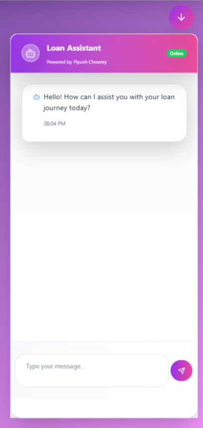

# @piyushchourey11/ai-chat-widget

A pluggable, standalone AI chatbot widget component for React applications with WebSocket support and form synchronization.

## Installation

```bash
npm install @piyushchourey11/ai-chat-widget
```

## Quick Start

```tsx
import { ChatBotProvider, ChatBot } from '@piyushchourey11/ai-chat-widget';

function App() {
  const [isChatOpen, setIsChatOpen] = useState(false);

  const config = {
    apiEndpoint: 'http://localhost:7000/api/chat',
    socketServer: 'http://localhost:7000',
    enabled: true,
    title: 'My Assistant',
    subtitle: 'Powered by AI',
  };

  return (
    <ChatBotProvider config={config}>
      <YourApp />
      <ChatBot
        isOpen={isChatOpen}
        setIsOpen={setIsChatOpen}
        flowType="default"
      />
    </ChatBotProvider>
  );
}
```

## Features

- ✅ **Pluggable**: Easy to attach/detach from any React project
- ✅ **Standalone**: Works independently or with provider
- ✅ **WebSocket Support**: Built-in Socket.IO integration
- ✅ **Form Synchronization**: Bidirectional form field updates
- ✅ **TypeScript**: Full type safety
- ✅ **Configurable**: Extensive configuration options
- ✅ **Responsive**: Mobile-friendly design
- ✅ **Theme Support**: Light/dark/auto themes

## Documentation

See the [full documentation](./docs/README.md) for detailed usage examples and API reference.

## License

MIT

## 📸 Demo Screenshot

